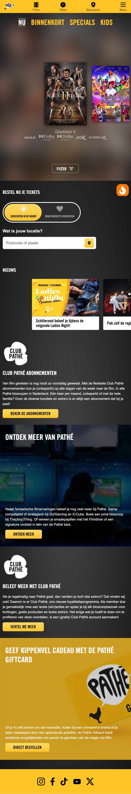
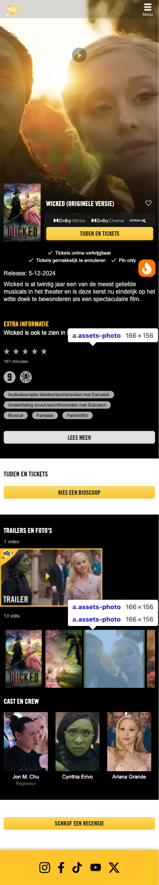
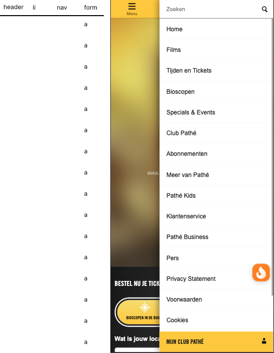
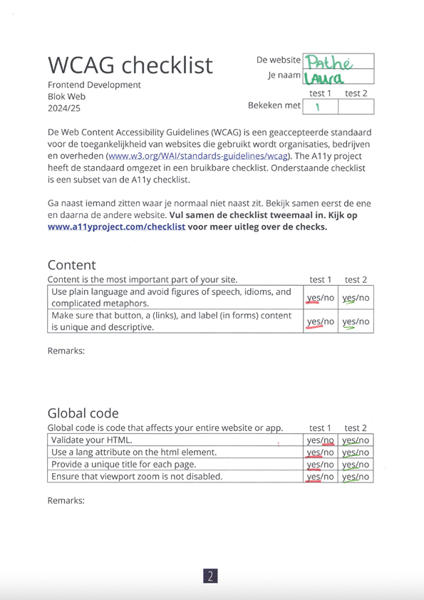
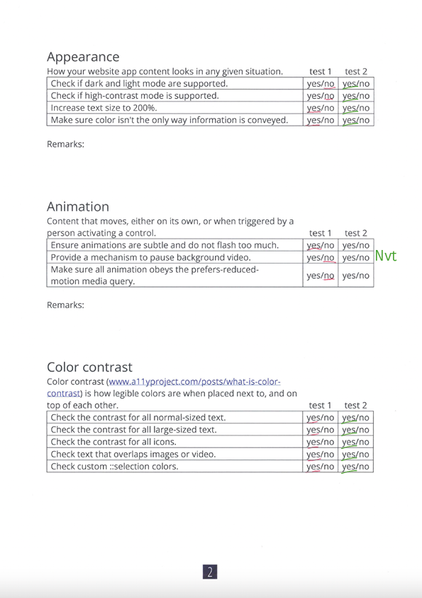
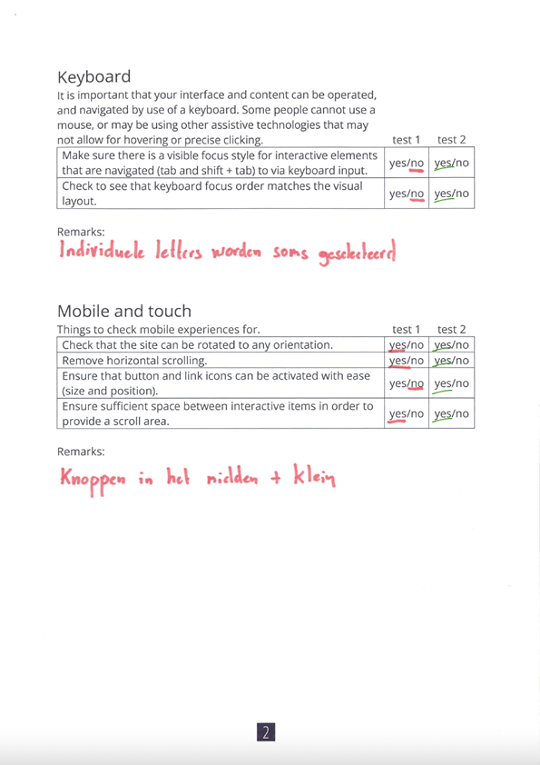
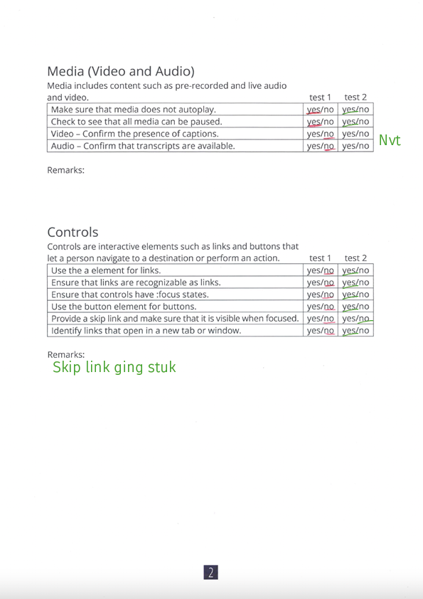
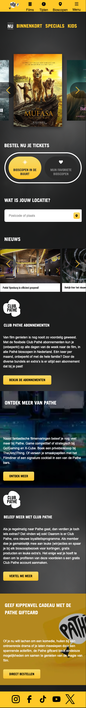
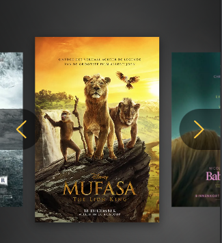

# Procesverslag
Markdown is een simpele manier om HTML te schrijven.  
Markdown cheat cheet: [Hulp bij het schrijven van Markdown](https://github.com/adam-p/markdown-here/wiki/Markdown-Cheatsheet).

Nb. De standaardstructuur en de spartaanse opmaak van de README.md zijn helemaal prima. Het gaat om de inhoud van je procesverslag. Besteedt de tijd voor pracht en praal aan je website.

Nb. Door *open* toe te voegen aan een *details* element kun je deze standaard open zetten. Fijn om dat steeds voor de relevante stuk(ken) te doen.

## Jij

  
uitwerken voor kick-off werkgroep

  ### Auteur:
  Laura Mostert

  #### Je startniveau:
 Blauw 

  #### Je focus:
Surface Plane

## Je website

  
uitwerken voor kick-off werkgroep

  ### Je opdracht:
  [https://www.pathe.nl/](http://www.pathe.nl/)

  #### Screenshot(s) van de eerste pagina (small screen): 
  hier de naam van de pagina  
  

  #### Screenshot(s) van de tweede pagina (small screen):
  hier de naam van de pagina  
  
 

## Toegankelijkheidstest 1/2 (week 1)

  
uitwerken na test in 2e werkgroep

  ### Bevindingen

  ### Screenreader
  De screenreader werkt niet heel erg goed op de website. Menuopties heten “menuoptie 1” “menuoptie 2” etc. Ook hebben de films niet normale namen, maar “film 1” en “pijltje”

Het enige wat goed wordt weergegeven op de website is de “locatie” balk.

  ### Scrollen zonder handen
  Scrollen en klikken zonder handen is erg lastig en nagenoeg onmogelijk.

  ### Tabben
  Bij het Tabben springt het alle kanten op

  
  
  
  
  
  

  

## Breakdownschets (week 1)

  
uitwerken na afloop 3e werkgroep

  ### de hele pagina: 
  

  ### dynamisch deel (bijv menu): 
  

## Voortgang 1 (week 2)

  
uitwerken voor 1e voortgang

  ### Stand van zaken
  hier dit ging goed & dit was lastig (neem ook screenshots op van delen van je website en code)

  ### Agenda voor meeting
  samen met je groepje opstellen

 Ik heb niet zoveel vragen, ik heb het idee dat ik het voor nu wel snap. 

  ### Verslag van meeting
  hier na afloop snel de uitkomsten van de meeting vastleggen
  
nvt. ik heb tijdens de meeting aan mijn code gewerkt.

## Voortgang 2 (week 3)

  
uitwerken voor 2e voortgang

  ### Stand van zaken
  Ik vond het maken van de carousel echt irritant lastig. Het brak contimu. Uiteindelijk de carousel van Sanne gebruikt, maar dat werkte niet echt. Uiteindelijk buttons gemaakt op basis van een codepen guide. 

  ### Agenda voor meeting
  samen met je groepje opstellen
Issues met mijn carousel. 
Vragen over hoe ik afbeeldingen correct moet positioneren.
Vragen over of een achtergrond bij de carousel wel moet

  ### Verslag van meeting
  hier na afloop snel de uitkomsten van de meeting vastleggen

  Carousel is gefixt
  Sybren heeft me enrom op weg geholpen met de carousel.
  

## Toegankelijkheidstest 2/2 (week 4)

  
uitwerken na test in 9e werkgroep

  
  
  
  
  

  ### Bevindingen
  Lijst met je bevindingen die in de test naar voren kwamen (geef ook aan wat er verbeterd is):

## Voortgang 3 (week 4)

  
uitwerken voor 3e voortgang

  ### Stand van zaken
  hier dit ging goed & dit was lastig (neem ook screenshots op van delen van je website en code)

Oneindig gekloot met de carousel
Gewoon werken aan de code tijdens de les
Vragen stellen over Github want mijn wite sil niet uploaden
Vragen naar additinele animaties en onderdelen.

  ### Verslag van meeting
  hier na afloop snel de uitkomsten van de meeting vastleggen

Github gefixt, lag aan een video
Additionele animaties aangepast waar nodig.

## Eindgesprek (week 5)

  
uitwerken voor eindgesprek

  ### Je uitkomst - karakteristiek screenshots:
  

  ### Dit ging goed/Heb ik geleerd: 
  Korte omschrijving met plaatjes

  

  Ik heb nachtmerrsies gehad over de carousel. Hij heeft echt ales gebroken, en het fixen hiervan was echt heel lastig. Sybren heeft uiteindelijk uit frustrai=tie een nieuwe carousel gebouwd die wederom niet werkte. het was echt een drama.

  Ik heb best veel opgepikt en snap nu veel meer dan vorig jaar. ik weet nu wel hoe ik correct nth of types moet gebruiken en niet alleen maar .classes continu. Ook snap ik beter hoe javascript werkt, maar ook dit is eigenlijk nogsteeds best ingewkkeld.

  ### Dit was lastig/Is niet gelukt:
  Korte omschrijving met plaatjes

  
    Ik heb nachtmerrsies gehad over de carousel. Hij heeft echt ales gebroken, en het fixen hiervan was echt heel lastig. Sybren heeft uiteindelijk uit frustrai=tie een nieuwe carousel gebouwd die wederom niet werkte. het was echt een drama.

Uiteindelijk zijn de volgende onderdelen niet gelukt:

section 1 ul li NU FILMS etc. animeren als buttons en als filter gebruiken bij de carousel. (als de carousel werkt, dan werkt het, ik ga er niet mee klooien. alle pogingen hebben het gesloopt)
W3C image modal box. ik weet nogsteeds niet waarom dit brak.

Ik had een leuke easteregg van een kip die langsrende. dit is ook stuk.
Ik kreeg de achtergrond niet veranderd met een kerstthema, ook niet op de verschillende manieren van Sanne. bagger............. bah

Code is niks voor mij. 

## Bronnenlijst

  
continu bijhouden terwijl je werkt

  Nb. Wees specifiek ('css-tricks' als bron is bijv. niet specifiek genoeg). 
  Nb. ChatGpT en andere AI horen er ook bij.
  Nb. Vermeld de bronnen ook in je code.

  Bronnen staan in de code vermeld.

